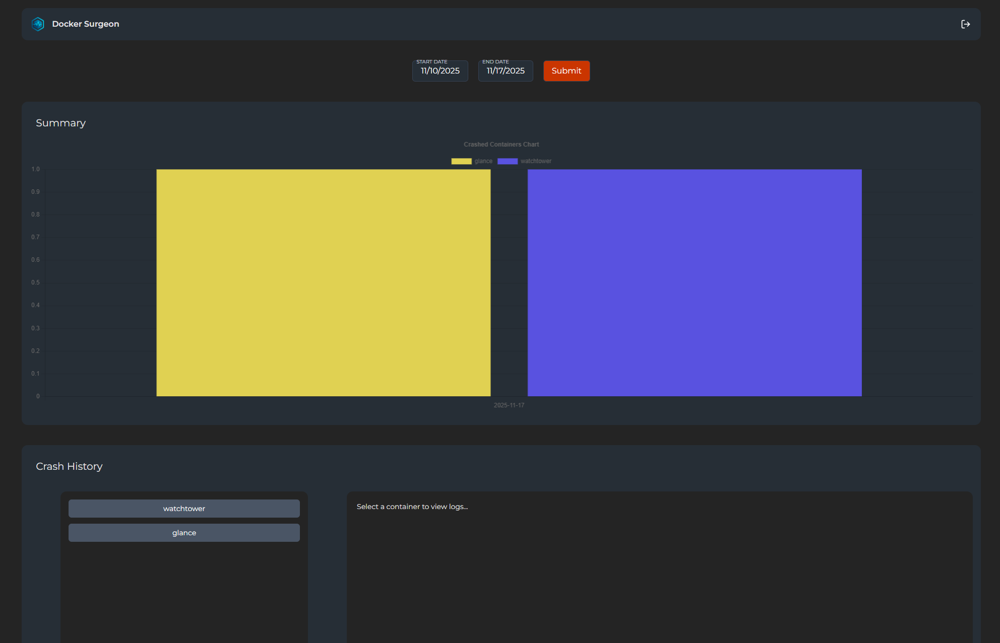

# Docker Surgeon
A Python service that monitors Docker containers in real time and automatically restarts them based on customizable rules, including any dependent containers.
Ideal for environments where high availability matters and zombie containers are not welcome at the party.

## ✨ Key Features
- Monitors Docker events in real time.

- Automatically restarts containers that are unhealthy or have unexpectedly exited.

- Supports a restart policy configurable via environment variables.

- Handles container dependencies using labels (com.monitor.depends.on).

- Detailed, timezone-aware logging.

- Supports container exclusion from restart policies.

## 🧭 How It Works

The service listens to Docker daemon events.
When it detects that a container is in an unhealthy state or has exited with a non-excluded code, it restarts it.
If the container has dependencies (defined through labels), it restarts those too, in the correct order, using topological sorting.

Example: `[db] --> [backend] --> [frontend]` </br>
If `db` goes down, the service will restart `db`, then `backend`, and finally `frontend`.


## 🧪 Environment Variables
Configuration is handled through a `.env` file in the project root.
Here’s an example:

```
# Restart policy in JSON format
RESTART_POLICY='{
  "excludedContainers": ["pihole", "db_backup"],
  "statuses": {
    "exited": {
      "codesToExclude": [0]
    }
  }
}'

# Log level
# Options: error, warn, info, debug
LOG_LEVEL=info

# Log timezone (pytz compatible)
LOG_TIMEZONE=UTC

```

### RESTART_POLICY

Defines which containers to ignore and which states should trigger a restart.

- `excludedContainers`: list of containers that should never be restarted.
- `statuses`:
    - `exited` → restart if the container exited with a non-excluded code.
        - `codesToExclude`: -> A list of codes that should *not* trigger a restart. Check codes [here](https://komodor.com/learn/exit-codes-in-containers-and-kubernetes-the-complete-guide/#:~:text=%EE%80%80Exit%EE%80%81%20%EE%80%80codes%EE%80%81%20are%20used)


### LOG_LEVEL

Controls log verbosity.</br>
Supported values: `error`, `warn`, `info`, `debug`.</br>
Default: `info`.

### LOG_TIMEZONE

Sets the timezone used in logs.</br>
Must be a valid pytz timezone.</br>
Examples: `UTC`, `Europe/Rome`, `America/New_York`.</br>
Default: `UTC`

Check the valid timezones [here](https://gist.github.com/heyalexej/8bf688fd67d7199be4a1682b3eec7568)

### ENABLE_DASHBOARD
Enables or disables the web dashboard.</br>
Default: `False`

### LOGS_AMOUNT
Number of log entries to retain when a container is restarted.

Default: `10`

### DASHBOARD_ADDRESS
Address interface for the dashboard:
- `127.0.0.1` -> Local only
- `0.0.0.0` -> accessible on LAN

Default: `0.0.0.0`

### DASHBOARD_PORT
Port on which the dashboard is served.</br>
Default: `8000`

### ADMIN_PASSWORD
Password for accessing the dashboard.
Support for three formats:
- **Plain text**
  - ADMIN_PASSWORD=r4nd0mP4ssW0rD
- [**Bcrypt**](https://bcrypt-generator.com/)
  - ADMIN_PASSWORD=$2a$12$9s8F...
- [**Argon2**](https://argon2.online/) 
  - ADMIN_PASSWORD=$argon2id$v=19$m=65536,t=3,p=4$...

The system automatically detects whether the value is plain text, bcrypt, or Argon2.</br>
If you want a strong random password (plain text), you can generate one using: `openssl rand -hex 32` *This is a plain password, not an encrypted hash*

## 🔐 Authentication Flow
1. User submits their password to /auth/login
2. The server validates it in this order:
    - argon2 verification
    - bcrypt `checkpw`
    - direct comparison (plain text)
3. If valid, a JWT token  is created and stored in a **HttpOnly Cookie**
4. Protected routes require thise cookie to be present and valid

## 🔗 Managing Container Dependencies

You can define container dependencies using the label `com.monitor.depends.on`.</br>
When a parent container is restarted, its dependent containers will be restarted too, in the correct order.

Example `docker-compose.yml`:

```
services:
    db:
        image: postgres
        container_name: db

    backend:
        image: my-backend
        container_name: backend
        labels:
        - "com.monitor.depends.on=db"

    frontend:
        image: my-frontend
        container_name: frontend
        labels:
        - "com.monitor.depends.on=backend"

    docker-surgeon:
        image: docker-surgeon-image
        container_name: docker-surgeon
        volumes:
            - /var/run/docker.sock:/var/run/docker.sock
        env_file:
            - path/to/.env
```

In this setup:</br>
If `db` crashes → `db`, `backend`, and `frontend` will be restarted in order.</br>
If `backend` crashes → `backend` and `frontend` will be restarted.</br>
If `frontend` crashes → only `frontend` will be restarted.

Multiple dependents can be specified for a container by separating them with a comma: `com.monitor.depends.on=backend,frontend,db`

## 🚀 Quick Start
```
docker run -d \
  --name docker-surgeon \
  -v /var/run/docker.sock:/var/run/docker.sock \
  -v $(pwd)/.env:/app/.env \
  krystall0/docker-surgeon:latest
```

You can also override environment variables directly:
```
docker run -d \
  --name docker-surgeon \
  -v /var/run/docker.sock:/var/run/docker.sock \
  -e LOG_LEVEL=INFO \
  -e LOG_TIMEZONE=Europe/Rome \
  -e RESTART_POLICY='{"excludedContainers":["pihole"],"statuses":{"exited":{"codesToExclude":[0]}}}' \
  krystall0/docker-surgeon:latest
```

### Example `docker-compose.yml`
```
version: "3.8"

services:
  docker-surgeon:
    image: krystall0/docker-surgeon:latest
    container_name: docker-surgeon
    restart: always
    volumes:
      - /var/run/docker.sock:/var/run/docker.sock
    env_file:
        - /path/to/.env

  db:
    image: postgres
    container_name: db

  backend:
    image: my-backend
    container_name: backend
    labels:
      - "com.monitor.depends.on=db"

  frontend:
    image: my-frontend
    container_name: frontend
    labels:
      - "com.monitor.depends.on=backend"
```

## 📊 Dashboard Overview
Docker Surgeon includes a built-in web dashboard that helps you inspect:
- Recent container crashes
- Logs grouped by container
- Crash statistics over time
- Interactive charts
- Date-based filtering
- Full log viewer with multiline formatting

To access the dashboard:</br>
```
http://<your-ip>:<your-port>
```
(Requires authentication — see [**Authentication Flow**](#-authentication-flow))

### Dashboard Preview


### ⚠️ Security Notes
- Do **not** expose the dashboard over the internet without HTTPS and reverse proxy protections
- Always use a strong admin password (preferably hashed)