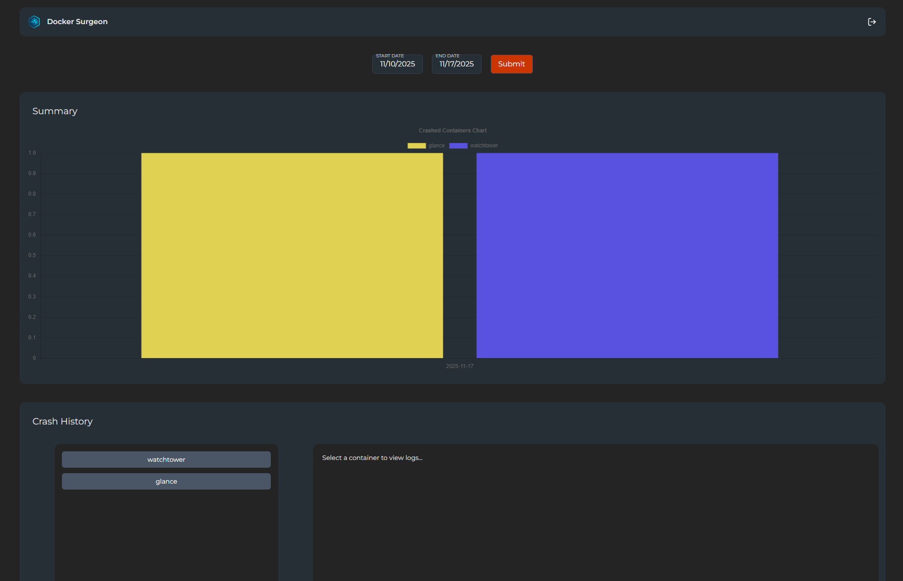

# Docker Surgeon
A Python service that monitors Docker containers in real time and automatically restarts them based on customizable rules, including any dependent containers.
Ideal for environments where high availability matters and zombie containers are not welcome at the party.

## ✨ Key Features
- Monitors Docker events in real-time.
- Automatically restarts containers that are unhealthy or have unexpectedly exited.
- Supports a restart policy configurable via environment variables.
- Handles container dependencies using labels (`com.monitor.depends.on`).
- Detailed, timezone-aware logging.
- Supports container exclusion from restart policies.
- Supports real-time [notifications](#-notifications) through [Apprise](https://github.com/caronc/apprise)
- **Multi-host support via Agents** — monitor and manage containers across multiple machines from a single server.

## 🧭 How It Works

The service listens to Docker daemon events.
When it detects that a container is in an unhealthy state or has exited with a non-excluded code, it restarts it.
If the container has dependencies (defined through labels), it restarts those too, in the correct order, using topological sorting.

Example: `[db] --> [backend] --> [frontend]` </br>
If `db` goes down, the service will restart `db`, then `backend`, and finally `frontend`.

## 🤖 Agents (Multi-host Support)

Docker Surgeon supports a distributed mode where a central **server** manages multiple remote **agents**, each running on a different machine. This allows you to monitor and control containers across your entire infrastructure from a single point.

### Architecture

```
[Server] ──HTTP/HTTPS──▶ [Agent A - Machine 1]
         ──HTTP/HTTPS──▶ [Agent B - Machine 2]
         ──HTTP/HTTPS──▶ [Agent C - Machine 3]
```

- The **server** runs the dashboard, the monitor logic, and communicates with all configured agents.
- Each **agent** runs on a remote machine, exposes a secured REST API, and has access to the local Docker daemon via the Docker socket.

### Running an Agent

On each remote machine, run the agent with Docker:

```yaml
# docker-compose.yml (on the remote machine)
services:
  agent:
    image: krystall0/docker-surgeon:latest
    container_name: docker-surgeon-agent
    command: agent
    ports:
      - "8001:8001"
    restart: unless-stopped
    volumes:
      - /var/run/docker.sock:/var/run/docker.sock
    environment:
      - AGENT_HOST=0.0.0.0
      - AGENT_PORT=8001
      - AGENT_TOKEN=yoursecuretokenhere
```

### Registering Agents on the Server

On the server, configure agents via the `AGENTS_CONFIG` environment variable as a JSON array:

```env
AGENTS_CONFIG='[
  {
    "name": "machine-1",
    "host": "192.168.1.50",
    "port": 8001,
    "token": "yoursecuretokenhere"
  },
  {
    "name": "machine-2",
    "host": "https://agent.example.com",
    "port": 443,
    "token": "anothersecuretoken",
    "verify_ssl": true
  }
]'
```

Each agent entry supports the following fields:

| Field | Required | Default | Description |
|---|---|---|---|
| `host` | ✅ | — | IP address or domain of the agent. Prefix with `https://` for TLS. |
| `name` | ❌ | `null` | Friendly name for the agent (used in logs). |
| `port` | ❌ | `80` / `443` | Port the agent listens on. Auto-defaults to `443` if host starts with `https://`. |
| `token` | ❌ | `null` | Bearer token to authenticate with the agent. Must match `AGENT_TOKEN` on the agent. |
| `verify_ssl` | ❌ | `true` | Whether to verify the agent's SSL certificate. Set to `false` for self-signed certificates on internal networks. |

### Agent Environment Variables

| Variable | Default | Description |
|---|---|---|
| `AGENT_HOST` | `127.0.0.1` | Address the agent binds to. Use `0.0.0.0` to accept remote connections. |
| `AGENT_PORT` | `8001` | Port the agent listens on. |
| `AGENT_TOKEN` | `null` | Secret token required to authenticate incoming requests. |

### Security Considerations

- Always set `AGENT_TOKEN` on every agent. Without it, the API is open to anyone who can reach the port.
- If the agent is exposed to the internet, place it behind a reverse proxy (Nginx, Caddy) with HTTPS enabled.
- For internal networks, HTTP with a strong token is generally sufficient.
- If using a self-signed certificate, set `verify_ssl: false` on the server side for that agent.

---

## 🧪 Environment Variables
Configuration is handled through a `.env` file in the project root.
Here's an example:

```
# Restart policy in JSON format
RESTART_POLICY = '{
    "excludedContainers": ["container_name"], #-> More than 1 container could be excluded. Specify them as ["container1", "container2"]
    "statuses": {
        "exited": {
            "codesToExclude": [0]   #-> More than 1 exit code could be excluded. Specify them as ["code1", "code2", "code3"]
        }
    }
}'

ENABLE_DASHBOARD=True #-> Possible values [True | False]
LOGS_AMOUNT=10 #-> This will display the last n logs on the dashboard to clearly indicate the issue that triggered the restart policy
DASHBOARD_ADDRESS=0.0.0.0 #-> Possible values [0.0.0.0 | 127.0.0.1]
DASHBOARD_PORT=8000 #-> Possible values [ Any free port ]
ADMIN_PASSWORD=
ENABLE_NOTIFICATIONS=True #-> Possible values [True | False]
NOTIFICATION_URLS='["url1", "url2"]' #-> Check https://github.com/caronc/apprise/wiki#notification-services
NOTIFICATION_TITLE="" #-> Edit the notification title as you wish
NOTIFICATION_BODY="" #-> Edit the notification body as you wish


###############
#   LOGGING   #   
###############

# --- Log Level ---
# Set the verbosity of logs. Options: "error", "warn", "info", "debug"
# Default: info
LOG_LEVEL= info

# --- Log Timezone ---
# Adjust the timezone used for logging
# e.g. Europe/Rome, America/New_York
LOG_TIMEZONE=UTC

AGENTS_CONFIG='[{"name": "my-server", "host": "192.168.1.50", "port": 8001, "token": "secret"}]'

# This is used to specify if the agent should bind to a specific host. 
# This is useful if the agent is running on the same machine as the main application and you want to restrict access to it. 
# Possible values [127.0.0.1 | 0.0.0.0]
# Default: 127.0.0.1
AGENT_HOST=127.0.0.1 

# This is the port on which the agent will listen for incoming requests. Make sure to set this to a free port. 
# Possible values [ Any free port ]
# Default: 8000
AGENT_PORT=8000 

# This is the token that the agent will use to authenticate incoming requests. Make sure to set this to a strong, unique value.
# Default: None
AGENT_TOKEN= yourtoken

```

### RESTART_POLICY

Defines which containers to ignore and which states should trigger a restart.

- `excludedContainers`: list of containers that should never be restarted.
- `statuses`:
    - `exited` → restart if the container exited with a non-excluded code.
        - `codesToExclude`: -> A list of codes that should *not* trigger a restart. Check codes [here](https://komodor.com/learn/exit-codes-in-containers-and-kubernetes-the-complete-guide/#:~:text=%EE%80%80Exit%EE%80%81%20%EE%80%80codes%EE%80%81%20are%20used)


### LOG_LEVEL

Controls log verbosity.</br>
Supported values: `error`, `warn`, `info`, `debug`.</br>
Default: `info`.

### LOG_TIMEZONE

Sets the timezone used in logs.</br>
Must be a valid pytz timezone.</br>
Examples: `UTC`, `Europe/Rome`, `America/New_York`.</br>
Default: `UTC`

Check the valid timezones [here](https://gist.github.com/heyalexej/8bf688fd67d7199be4a1682b3eec7568)

### ENABLE_DASHBOARD
Enables or disables the web dashboard.</br>
Default: `False`

### LOGS_AMOUNT
Number of log entries to retain when a container is restarted.

Default: `10`

### DASHBOARD_ADDRESS
Address interface for the dashboard:
- `127.0.0.1` -> Local only
- `0.0.0.0` -> accessible on LAN

Default: `0.0.0.0`

### DASHBOARD_PORT
Port on which the dashboard is served.</br>
Default: `8000`

### ADMIN_PASSWORD
Password for accessing the dashboard.
Support for three formats:
- **Plain text**
  - ADMIN_PASSWORD=r4nd0mP4ssW0rD
- [**Bcrypt**](https://bcrypt-generator.com/)
  - ADMIN_PASSWORD=$2a$12$9s8F...
- [**Argon2**](https://argon2.online/) 
  - ADMIN_PASSWORD=$argon2id$v=19$m=65536,t=3,p=4$...

The system automatically detects whether the value is plain text, bcrypt, or Argon2.</br>
If you want a strong random password (plain text), you can generate one using: `openssl rand -hex 32` *This is a plain password, not an encrypted hash*

### ENABLE_NOTIFICATIONS
Enables or disables real-time notifications.</br>
Supported values: `True` | `False`</br>
Default: `False`</br>
See [the notification's section](#-notifications) for more details

### NOTIFICATION_URLS
A JSON-formatted list of notification endpoints, as documented in the [Apprise URL specification](https://github.com/caronc/apprise/wiki)</br>
Expected Syntax: `'["url1", "url2"]'`</br>
⚠️ *This must be valid JSON — use double quotes inside the list*.

### NOTIFICATION_TITLE
The title template for notifications.</br>
Supports placeholders and emoji.</br>
Default: `'⚠️ {container_name} crashed'`

Supported placeholders:
- {container_name}
- {logs}
- {exit_code}
- {n_logs}

### NOTIFICATION_BODY
The body template for notifications.</br>
Supports placeholders, multiline text (\n), and Markdown formatting.</br>
Does **not** support icons/emoji (depending on the provider).</br>
Default: ```'`exit code`: `{exit_code}`\nLast {n_logs} logs of `{container_name}`: {logs}'```

Supported placeholders:
- {container_name}
- {logs}
- {exit_code}
- {n_logs}


## 🔐 Authentication Flow
1. User submits their password to /auth/login
2. The server validates it in this order:
    - argon2 verification
    - bcrypt `checkpw`
    - direct comparison (plain text)
3. If valid, a JWT token  is created and stored in a **HttpOnly Cookie**
4. Protected routes require thise cookie to be present and valid

## 🔗 Managing Container Dependencies

You can define container dependencies using the label `com.monitor.depends.on`.</br>
When a parent container is restarted, its dependent containers will be restarted too, in the correct order.

Example `docker-compose.yml`:

```
services:
    db:
        image: postgres
        container_name: db

    backend:
        image: my-backend
        container_name: backend
        labels:
        - "com.monitor.depends.on=db"

    frontend:
        image: my-frontend
        container_name: frontend
        labels:
        - "com.monitor.depends.on=backend"

    docker-surgeon:
        image: docker-surgeon-image
        container_name: docker-surgeon
        volumes:
            - /var/run/docker.sock:/var/run/docker.sock
        env_file:
            - path/to/.env
```

In this setup:</br>
If `db` crashes → `db`, `backend`, and `frontend` will be restarted in order.</br>
If `backend` crashes → `backend` and `frontend` will be restarted.</br>
If `frontend` crashes → only `frontend` will be restarted.

Multiple dependents can be specified for a container by separating them with a comma: `com.monitor.depends.on=backend,frontend,db`

## 🚀 Quick Start
```
docker run -d \
  --name docker-surgeon \
  -v /var/run/docker.sock:/var/run/docker.sock \
  -v /your/path/data:/app/app/data \  # persistent data (recommended if dashboard is enabled)
  -v $(pwd)/.env:/app/.env \
  krystall0/docker-surgeon:latest
```

You can also override environment variables directly:
```
docker run -d \
  --name docker-surgeon \
  -v /var/run/docker.sock:/var/run/docker.sock \
  -v /your/path/data:/app/app/data \ # persistent data (recommended if dashboard is enabled)
  -e LOG_LEVEL=INFO \
  -e LOG_TIMEZONE=Europe/Rome \
  -e RESTART_POLICY='{"excludedContainers":["pihole"],"statuses":{"exited":{"codesToExclude":[0]}}}' \
  krystall0/docker-surgeon:latest
```

### Example `docker-compose.yml`
```
version: "3.8"

services:
  docker-surgeon:
    image: krystall0/docker-surgeon:latest
    container_name: docker-surgeon
    restart: always
    volumes:
      - /var/run/docker.sock:/var/run/docker.sock
      - /your/path/data:/app/app/data # persistent data (recommended if dashboard is enabled)
    env_file:
        - /path/to/.env

  db:
    image: postgres
    container_name: db

  backend:
    image: my-backend
    container_name: backend
    labels:
      - "com.monitor.depends.on=db"

  frontend:
    image: my-frontend
    container_name: frontend
    labels:
      - "com.monitor.depends.on=backend"
```

## 📊 Dashboard Overview
Docker Surgeon includes a built-in web dashboard that helps you inspect:
- Recent container crashes
- Logs grouped by container
- Crash statistics over time
- Interactive charts
- Date-based filtering
- Full log viewer with multiline formatting

To access the dashboard:</br>
```
http://<your-ip>:<your-port>
```
(Requires authentication — see [**Authentication Flow**](#-authentication-flow))

### Dashboard Preview


## 🔔 Notifications

Docker Surgeon can send real-time notifications whenever a container crashes.
Notifications are handled through Apprise, supporting 70+ services including:
- Discord
- Telegram
- Slack
- Matrix
- Email
- Webhooks
- Gotify / Pushover / Pushbullet

And many others…

See [Apprise](https://github.com/caronc/apprise) for more details

### Enabling Notifications
Add these variables to your `.env`:</br>
```
ENABLE_NOTIFICATIONS=True
NOTIFICATION_URLS=["discord://<webhook_id>/<webhook_token>"]
NOTIFICATION_TITLE="⚠️ {container_name} crashed"
NOTIFICATION_BODY="`exit code`: `{exit_code}`\nLast {n_logs} logs:\n{logs}"
```

### Formatting Notifications
Docker Surgeon supports placeholder variables inside `NOTIFICATION_TITLE` and `NOTIFICATION_BODY`.</br>
Available placeholders:
- `{container_name}` → name of the crashed container
- `{exit_code}` → container exit code
- `{logs}` → last N logs (ANSI colors removed)
- `{n_logs}` → number of logs configured in `LOGS_AMOUNT`

Example notification body:</br>
`exit code`: `{exit_code}`</br>
Container `{container_name}` crashed.</br>
Last {n_logs} logs:</br>
{logs}


### ⚠️ Security Notes
- Do **not** expose the dashboard over the internet without HTTPS and reverse proxy protections
- Always use a strong admin password (preferably hashed)
- Always set `AGENT_TOKEN` on every agent to prevent unauthorized access